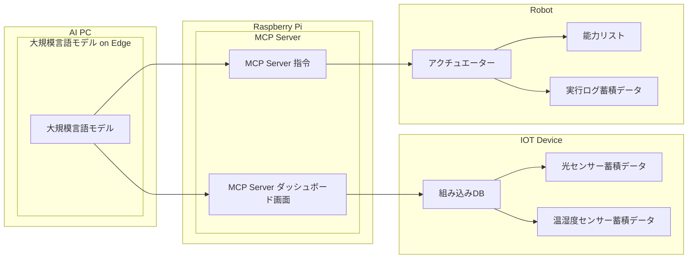

# Tokyo Maker Faireに使うMCP コンセプト
IotのデバイスにMCPサーバーと接続します。
## 構成図

```mermaid
graph LR

    subgraph Edge Big[AI PC]
        subgraph LLM On Edge[大規模言語モデル on Edge]
            LLM[大規模言語モデル]
        end
    end
    subgraph Edge[Raspberry Pi]
        subgraph MCP Server[MCP Server]
            mcp_dashboard[MCP Server ダッシュボード画面]
            mcp_instuct[MCP Server 指令]
        end
    end
    subgraph Device[IOT Device]
        light_sensor[光センサー蓄積データ]
        temp_sensor[温湿度センサー蓄積データ]
        db[組み込みDB]
        db --> light_sensor
        db --> temp_sensor
    end
    subgraph Robot[Robot]
        ability_list[能力リスト]
        actuator[アクチュエーター]
        action_log[実行ログ蓄積データ]
        actuator --> ability_list
        actuator --> action_log
    end
    LLM --> mcp_dashboard
    LLM --> mcp_instuct
    mcp_dashboard --> db
    mcp_instuct --> actuator
```
## TMFの中にデモしたいユースケース
- プログラミング無しで、会話でIOTデータのダッシュボードの作成を行う。
- 会話でのロボットへの作業指示を行う。
